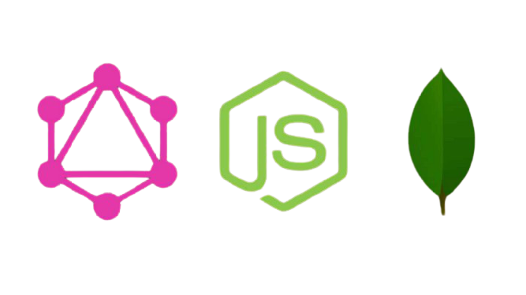

<h4 align="center"> 
  

API com <a href="https://graphql.org/">GraphQL</a> + <a href="https://nodejs.org/en/">Node</a> + <a href="https://www.mongodb.com/">MongoDB</a>

</h4>

## Conteúdo

- [O que é GraphQL](#-o-que-é-graphql)
- [Porque utilizar](#-porque-utilizar-graphql)
- [Construindo sua primeira API GraphQL](#-construindo-sua-primeira-api-graphql)

  - [API](#-api)

    - [Estrutura de pastas](#-estrutura-de-pastas)

  - [Banco de dados](#-banco-de-dados)

## 🤔 O que é GraphQL?

[GraphQL](https://graphql.org/) é uma linguagem de consulta e ambiente de execução voltado a servidores para as APIs, cuja prioridade é fornecer exatamente os dados que os clientes solicitam e nada mais.

## 🤟 Porque utilizar GraphQL?

- As chamadas do GraphQL são processadas em uma única transmissão com ida e volta. Os clientes recebem exatamente o que solicitam, sem mais dados do que o necessário (overfetching).
- Os tipos de dados são bem definidos, o que reduz as falhas de comunicação entre o cliente e o servidor.
- O GraphQL permite evoluir a API de uma aplicação sem prejudicar as consultas existentes.

## 🚀 Construindo sua primeira API GraphQL
